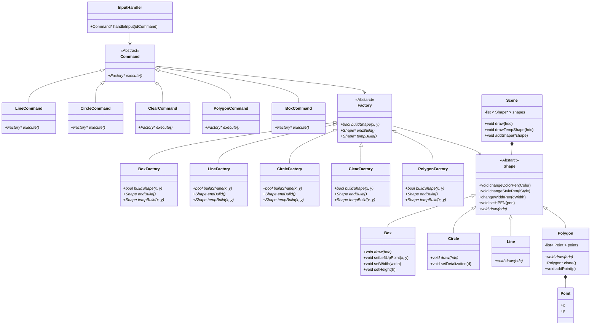

# Geometry_Figure
## Описание
 Тестовое задание для Топ Систем
Стек технологий:
 - C++17
 - WinAPI
## Функции, которые были реализованы:
 1. Возможность создания фигур: 
    - Линяя
    - Прямоугольник
    - Окружность, при компиляции можно менять детализацию окружности (по умолчанию 30)
    - Полигон
 2. Возможность менять цвет фигур (пока, что при компиляции проекта)
 3. Возможность создавать элементы на форме при помощи кнопок:
      ○ - Рисовать окружность из центра
      \ - Рисовать линию по двум точкам
      □ - Рисовать прямоугольник по двум точкам, начиная слевого верхнего угла
      ⎔ - Рисовать полигон (погрешность между пиксилями 20)
      ◧ - Очистить текущее полотно

# Структура проекта

 ## Экранные формы:
 - Форма при запуске приложения  
  
 - Форма после того как нарисовали круг  
 
 - Форма после того как нарисовали линию  
 
 - Форма после того как нарисовали прямоугольник  
 
 - Форма после того как нарисовали полигон  
 
 - Форма после нажатия "Очистка"  
 
 
